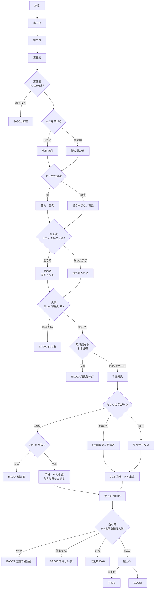

# 05 分岐とフラグ設計

全変数の設定箇所・参照箇所の一覧は `docs/generated/flags_reference.md`（`node tools/validate.js --report` で自動生成）を正とする。本書はその設計意図をまとめたもの。

---

## 1. パラメータ

### 1-1. 好感度 `aff.<キャラ>`（0〜100、初期値20）
キャラID：`reny` `hyu` `jin` `muni` `gel` `neo`

| 用途 | 閾値 | 場所 |
|---|---|---|
| ネオが秘密（館にひとり・口調は祖父の真似）を明かす | aff.neo ≥ 35 | 第11話 ep11_check / ep11_direct |
| ゲルが「出てくれ」と言う | aff.gel ≥ 40 | 第12話 ep12_end |
| ジンパチが5年前の火事を告白（F_JIN_PAST） | aff.jin ≥ 40 | 第14話 ep14_jin |
| ヒュウが「本当のこと」を選ぶ（理由を聞かずとも） | aff.hyu ≥ 50 | 第15話 ep15_truth_try |
| ゲルが白眠の仮説を教える（F_GEL_THEORY） | 【嘘】aff.gel ≥ 40 ／【真】≥ 50 ／第五夜 ≥ 40 | 第16話・第20話 |
| 火事で「大丈夫、行って！」が通る | aff.jin ≥ 60 | 第19話 ep19_n_go |
| ネオ説得「ホテルなんてどうでもいい」が通る | aff.neo ≥ 70 | 第19話 ep19_neo_b |
| ネオ説得「ムニが待ってる」が通る | aff.neo ≥ 50 または aff.muni ≥ 60 | 第19話 ep19_neo_c |
| 個別エンディングの相手 | 名前を知る者の中で最大（同値は レニィ→ヒュウ→ジンパチ→ムニ→ゲル→ネオ） | ep_ind_wake `@set_top` |

### 1-2. こころ `kokoro`（0〜10、初期値5）主人公の心の余力
- **上がる**：心を開いた返答、日常の喜び（夜食会+1、救出+2等）、昼パートで「すぐに眠る」+1、手紙を読む+3
- **下がる**：6回目まで受話器を取れない-1、強がり-1、無言電話を切る-1、踏み込みすぎ-1、言えない罪-1、誰かを救えなかった-1
- **効果**
  - 第四夜開始時 `kokoro ≤ 3` → 「電話線を抜く」選択肢が出現（**BAD01 断線**）
  - 第六夜 `kokoro ≥ 5` → 「電話の向こうの全員に名乗る」選択肢が出現

### 1-3. ルート変数

| 変数 | 値 | 決定箇所 | 影響 |
|---|---|---|---|
| `MUNI_LOC` | `"RENY"` / `"HOTEL"` | 第13話：ムニを誰に預けるか | 第14話の内容、第五夜の火災現場（アパート／月見館）、救出の鍵となる伏線 |
| `ROUTE` | `"LIE"` / `"TRUTH"` | 第15話：ヒュウの放送 | 第16・18・20・21話、ヒュウ×ジンパチの関係、火事でヒュウが「街の目」になるか |
| `RENY_STATE` | `"AWAKE"` / `"ASLEEP"` | 第17話：起こせたか | 周回ヒント、最終夜の人数、TRUE条件 |
| `JIN_STATE` | `"OK"` / `"INJURED"` | 第19話：救出経路 | 第六夜の移動（ネオが運転）、G_DREAM_FIRE |
| `BASE` | `"HOTEL"` / `"RENY_APT"` | 火事の後の拠点（燃えなかった方） | 第20・21・24話の描写 |
| `MINASE_SEARCH` | `"DREAM"` / `"ROUTE"` / `"LOST"` | 第21話：手がかり | DREAM=22:40発見（周回）、ROUTE=2:10発見（2:22のジレンマ発生）、LOST=見つからない |
| `MINASE_STATE` | `"AWAKE"` / `"ASLEEP"` / `"LOST"` | 第22・23話 | 最終夜の扉を開ける人、TRUE条件 |
| `CHOSE_2222` | `"MUNI"` / `"GEL"` | 第23話 | MUNI→BAD04、GEL→ミナセ眠ったまま |
| `W` | 0〜6 | 第七夜冒頭で算出 | エンディング判定 |
| `TOP` | キャラID | 個別END判定 | 個別エンディングの相手 |
| `FAV_DISH` | pudding/omelet/noodle | 自由通話B（ネオ） | 最後の朝食会の一皿 |

---

## 2. フラグ一覧（主要）

### 名乗り（最重要）
| フラグ | 立つ場所 | 意味 |
|---|---|---|
| F_NAME_RENY | 第1話 ep01_name / 第24話 全員に名乗る | レニィに名乗った |
| F_NAME_NEO | 第6話 ep06_name / 第24話 | ネオに名乗った |
| F_NAME_MUNI | 第8話 ep08_name / 第24話 | ムニに名乗った |
| F_NAME_JIN | 第9話 ep09_jinname / 第10話 電波で名乗る（ラジオを聴いている）/ 第24話 | ジンパチが名前を知る |
| F_NAME_HYU | 第10話 電波で名乗る / 第24話（和解時のみ） | ヒュウが名前を知る |
| F_NAME_GEL | 第10話 電波で名乗る（ゲルも聴いている）/ 第12話 ep12_givename / 第23話（隣室だと明かしていれば手紙から推測 or 告白時） | ゲルが名前を知る |
| F_NAME_ONAIR | 第10話 | 電波で名乗った（ヒュウ・ジンパチ・ゲルの3人に一度に伝わる） |
| F_NAME_ALL | 第24話 | 規則を完全に破った |

### 救出・分岐の鍵
| フラグ | 立つ場所 | 回収先 |
|---|---|---|
| F_RENY_OHAYO | 第1話で「朝まで話そう」or「どうして？」 | 第17話「おはよう、レニィ」で目覚め |
| F_RENY_PHONEWAKE | 第1話（全ルート） | 第17話「電話だよ」（反応はするが起きない＝ヒント） |
| F_RENY_WISH | 第9話「最後にしたいこと」 | 第17話（ゲルの仮説と組で）「朝ごはんだよ」で目覚め／第24話 |
| F_GEL_THEORY | 第16話・第20話（好感度条件） | 第17話の別解、第22話 |
| F_RENY_ROOF | 第7話（レニィを取る）/ 第14話 窓 / 自由通話B | 第19話 アパート火災「屋上へ！」 |
| F_NEO_BACKSTAIRS | 第11話「月見館の話」/ ネオの告白 / 第14話（月見館） | 第19話 月見館火災「裏階段！」 |
| F_MUNI_ATTIC | 第14話（月見館） | 第19話「屋根裏にいる！」の確信（無くても選べるが推測になる） |
| F_NEO_GRANDPA | 第11話 ネオの告白 / 周回：レニィの夢（G_END_BAD03） | 第19話 説得「おじいさんの言葉で話すあなたが…」 |
| F_JIN_PAST | 第14話（aff.jin≥40） | 第19話で彼の言葉が蘇る＝正解のヒント／第21話 和解 |
| F_JIN_LINE | 第19話「電話、切らないで。私も一緒に行く」 | 第27話 |
| F_HYU_EYES | 第18話（真実ルート） | 第19話 ヒュウが火事の状況を実況（屋上経路・屋根裏の影を教える） |
| F_MINASE_ROUTE | 第三夜明け「中央薬局ってどこ？」 | 第13話 捜索範囲、第21話 MINASE_SEARCH=ROUTE |
| F_MUNI_SORRY | 第12話「練習しようか」（全選択肢が合流） | 第22話 ムニの呼びかけ完全版 |
| F_HYU_REASON | 第15話「どうしてそこまで？」 | 第18話 擁護の説得力／第21話 和解の一段目 |
| F_DEFEND_HYU / F_HYU_HEARD | 第18話・第20話 | 第21話 和解の二段目の別解 |
| F_CONDEMN_HYU | 第18話・第20話 | 第21話 ヒュウが和解を拒む（謝れば解除） |
| F_KNEW_MIL_TOLD | 第12話「ミルを、知っています」 | 第23話 ゲルが手紙から名前を知る |
| F_MIL_CHART | 昼パート「机の引き出し」 | 第23話 星図の真相／第27話・ゲルEND |
| F_CONFESS_MIL | 第23話「私も、あの夜…」 | 第25話ミルの台詞、TRUE条件 |
| F_LETTER / F_LETTER_READ | 第五夜章末 / 第23話 | ゲル生存の前提 |
| F_BANQUET_PROMISE | 第17話（レニィ覚醒時） | 第19話「約束したばかりなのに」 |
| F_NEO_JIN_MET | 自由通話A「つなぐ」 | 第13・14・17話の関係描写 |

### 周回フラグ（グローバル、`G_` 始まり。セーブをまたいで保持）
| フラグ | 立つ場所 | 効果 |
|---|---|---|
| G_CLEAR_ONCE | いずれかのEND | 第1話 レニィ「また会えたね」／第27話 レニィの台詞追加 |
| G_END_xxx | 各END到達時 | エンディングリスト／ヒント |
| G_DREAM_FIRE | 火事でジンパチ負傷、BAD02、BAD03 | 第17話 レニィの夢「電話を切っちゃだめ」「ムニは上に」→ 第19話で経路選択肢を解放（F_DREAM_FIRE） |
| G_END_BAD03 | BAD03 | レニィの夢でネオの口調の理由を知る（F_NEO_GRANDPA） |
| G_DREAM_2222 | 第23話の割り込み着信に遭遇 | **レニィの夢でミナセの居場所が分かる（F_DREAM_MINASE）→ 2:22前にミナセを起こせる → TRUEへの唯一の道** |
| G_END_BAD05 / BAD06 | BAD05/06 | レニィの夢「名前を知らない人の声は届かない」 |
| G_TRUE | TRUE | タイトルに☆ |

> 周回ヒントの作中理屈：白眠の夢は「別の夜（別の分岐）」を見せる（第一夜から既視感として伏線）。レニィは起こされたときにだけ、それを語る。**レニィを起こせなかった周回ではヒントも得られない**。

---

## 3. 分岐点一覧

### 大分岐（ルートの形が変わる）
| # | 場所 | 選択 | 結果 |
|---|---|---|---|
| A | 第13話 | ムニを「レニィに迎えに行ってもらう」／「月見館に預ける」 | 第14話の日常が別物に。第五夜の火災現場が変わる（アパート／月見館） |
| B | 第15話 | ヒュウの放送「優しい嘘」／「本当のこと」（好感度・理由で可否） | LIE：花火→ゲルの告発→訂正放送→暴動→ヒュウ襲撃→和解イベント ／ TRUTH：番号が電波に→鳴りやまない電話→停電→ヒュウが街の目に |
| C | 第23話 | 2:22の割り込み：「ムニの声を届け続ける」／「ゲルに出る」（20秒の時限選択。放置でムニ側） | ムニ側→ミナセ目覚め→ゲル死亡（BAD04）／ゲル側→ゲル生存・最終の真相→ミナセ眠ったまま |

### 中分岐（生死・状態が変わる）
| 場所 | 条件／選択 | 結果 |
|---|---|---|
| 第四夜冒頭 | kokoro≤3 で「電話線を抜く」 | BAD01 |
| 第17話 | 3回まで呼びかけ。「おはよう、レニィ」(F_RENY_OHAYO) か「朝ごはんだよ」(F_RENY_WISH&&F_GEL_THEORY) | 覚醒／眠ったまま（RENYルートならムニとともに月見館へ移送＝火災現場も月見館に） |
| 第19話 | ジンパチへの言葉（2回まで） | 「一緒に行く」or（aff≥60で「大丈夫」）→動ける ／ 失敗→BAD02 |
| 第19話 | 経路（知識フラグで正解が表示される） | 完璧救出 JIN=OK ／ 負傷 JIN=INJURED |
| 第19話 | ネオの説得 | 生還／BAD03 |
| 第21話 | ヒュウとジンパチをつなぐ（LIEのみ） | 2段の説得（RECON≥2）で和解／断絶 |
| 第25話 | 夢に留まる×2 | BAD06 |

### 小分岐（台詞・好感度・フラグが変わる）
各話の三択。原則として **どの選択にも固有の返答と情報** があり、「正解一つ・不正解二つ」にしない（例：第1話Bを選ぶとレニィは両親の話をしないが、「電話の音だけは起きられる」は聞ける）。

---

## 4. 同時着信（シュレディンガーの電話）

| 場所 | LINE1 | LINE2 | 取らなかった側 |
|---|---|---|---|
| 第7話 | レニィ | 非通知（ヒュウ） | 留守録で聞ける。レニィ側を取ると「隣の屋上」情報、ヒュウ側を取るとヒュウ好感度+10 |
| 第9話 | レニィ | ジンパチ | 「三者」で両方取れる（能力獲得の演出） |
| 第16話（真実） | 見知らぬ人々 | レニィ／ゲル | レニィの眠りに落ちる声、ゲルの仮説が留守録に（好感度条件で2:22に回収） |
| 第23話 | 三者通話（ムニ＋ジンパチ） | 割り込み：ゲル | **片方の箱しか開けられない**。周回で両方を開ける |

---

## 5. エンディング判定

```
第七夜冒頭：
  W = count( F_NAME_RENY && RENY_STATE=="AWAKE",
             F_NAME_HYU, F_NAME_JIN, F_NAME_MUNI, F_NAME_GEL, F_NAME_NEO )
  （＝名前を知っていて、起きている人数）

  if W == 0                      → BAD05 沈黙の受話器
  夢で「留まる」を2回            → BAD06 やさしい夢
  if 1 <= W <= 3                 → 4:30に目覚める → TOP（名前を知る者のうち好感度最大）の個別END
  if W >= 4                      → 21:47に目覚める → 屋上へ
       if RENY_STATE=="AWAKE" && MINASE_STATE=="AWAKE" && F_HYU_RECONCILED && W==6 && F_CONFESS_MIL
                                 → TRUE おはよう、世界
       else                      → GOOD 白い朝の食卓（欠けたものに応じて描写が変わる）
```
※ 途中死亡は即時BAD（BAD02/03/04）。BAD01は第四夜。

### フローチャート



---

## 6. 好感度の主な獲得機会（キャラ別）

| キャラ | 第一夜 | 第二夜 | 第三夜 | 第四夜 | 第五夜 | 第六〜七夜 |
|---|---|---|---|---|---|---|
| レニィ | 第1話 +5〜15 | 第7話 +5〜10 | 夜食会 +5〜10／自由通話B +10 | 迎え +5／砦 +5／嘘を告げる +5 | 目覚め +15／晩餐会 +5 | 第27話 +5 |
| ヒュウ | ― | 第7話 +10〜20 | 出演 +10〜15／断る +5／自由通話B +10 | 理由を聞く +10 | 【嘘】届いてる +15、甘やかす +10／【真】+15 | 謝罪 +10／和解 +10／素顔 +10 |
| ジンパチ | ― | 第5話 +0〜10／自由通話A +5〜10 | 夜食会 +5〜10／名乗る +5／自由通話B +10 | 運ぶ +5／告白 +5〜10 | 一緒に行く +10／泣く +5〜10 | 和解 +5／第27話 +5 |
| ムニ | 第4話 +5〜10 | 名乗る +10／絵 +5 | 練習 +10〜15 | 707を明かす +10／砦・読み聞かせ +5 | 晩餐会 +5 | 目覚め +10／まかない +5／第27話 +5 |
| ゲル | 待つ +10／切る -5 | 沈黙を待つ +5 | 妹を知る +10／理解 +10／名乗る +5 | 嘘をつく -10 | 聞く +5〜10／嘘の詫び +5 | 告白 +10／第27話 +5 |
| ネオ | 怖い +10 | オムレツ +10／名乗る +5／自由通話A +5〜10 | 告白 +10／館・祖父 +5／自由通話B +10 | 預かる +5／読み聞かせ +5 | 説得 +15／晩餐会 +5 | まかない +5／第27話 +5 |
