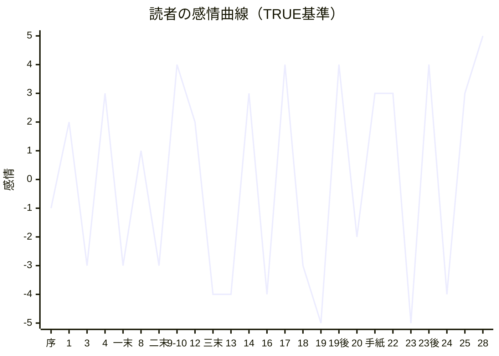

# 07 キャラクターの感情曲線

値は −5（絶望）〜 +5（救い）。TRUEルート（周回・全員救出）を基準とし、分岐による落差を併記する。
**「読者が安心した瞬間に絶望を入れる」** ため、各キャラの曲線の谷は、必ず直前に山（日常）を置いている。

## 1. 読者の感情曲線（全体）

| 時点 | 値 | 出来事 |
|---|---|---|
| 序章 | −1 | 閉じた部屋、残り七日 |
| 第1話 | +2 | しおバター、名前を呼ばれる温かさ |
| 第2話 | +2 | ネオのコメディ |
| 第3話 | −3 | 2:22の無言電話（恐怖） |
| 第4話 | +3 | ムニの寝息 |
| 第一夜章末 | −3 | 道で眠る人々 |
| 第5〜7話 | +3 | 配達話、炭オムレツ、しりとり |
| 第8話 | −2 → +3 | 「ミル？」の戦慄 → ムニの絵 |
| 第二夜章末 | −3 | 「その部屋に、誰がいる」 |
| 第9〜10話 | **+4** | 電話越しの夜食会、オンエア（最初の幸福のピーク） |
| 第11話 | +1 | ネオの告白（切なさ） |
| 第12話 | −1 → +2 | ゲルの敵意 → 姉と判明／ムニの「おかえり」練習 |
| 第三夜章末 | **−4** | ミナセが来ない |
| 第13話 | −4 | ムニの「じゅうじまで、まってたの」、ミナセ＝ムニの母、主人公の罪悪感 |
| 第14話 | +3 | 毛布の砦／読み聞かせ（束の間） |
| 第15話 | −2 | 橋の群衆、嘘の是非 |
| 第16話 | +2 → **−4** | 【嘘】花火と歓声 → レニィ眠る ／【真】少女を救う → 眠りの留守電 |
| 第17話 | **+4** | 「おはよぉ」、夜11時の朝ごはん、晩餐会の約束（二度目の幸福のピーク） |
| 第18話 | +2 → −3 | ヒュウの十七通 → 訂正放送／停電 |
| 第19話 | **−5** | 火事（最初のどん底） |
| 第19話後半 | +4 | 「今度は、逃げなかった」 |
| 第20話 | −2 | ゲルの告白、主人公の罪の自覚 |
| 第五夜章末〜昼 | +3 | ミルの手紙「出てくれなかった夜があっても、いいの」 |
| 第21〜22話 | +3 | 和解、まかない、ミナセ発見 |
| 第23話 | **−5** | 2:22の割り込み（二度目のどん底：選択の痛み） |
| 第23話後半 | +4 → −3 | ゲルが泣き、ドームを出る → 全員が眠るという真相 |
| 第24話 | +3 → −4 | 最後にしたいこと → 受話器が落ちる |
| 第25話 | −2 → +3 | 白い夢の誘惑 → 名前を呼ぶ声 |
| 第26〜27話 | +4 | ガラス越しの初対面 |
| 第28話・TRUE | **+5** | 部屋の外、屋上、「おはよう」 |
| TRUE後日談 | ? | 「もしもし」（余白） |

## 2. キャラクター別

### レニィ
| 夜 | 一 | 二 | 三 | 四 | 五 | 六 | 七 |
|---|---|---|---|---|---|---|---|
| 値 | −1（眠れない恐怖）→+2 | +2（しりとり） | +4（夜食会・夜明け） | +3（毛布の砦）→**−5**（白眠） | **+5**（目覚め）→−4（火事・部屋を失う） | +2（まかない） | +5（最後まで起きている） |
- 転換点：第17話。「眠るのが怖い」から「最後まで、みんなといたい」へ。
- 分岐落差：起こせなかった場合、第七夜は「眠ったまま、夢の中で朝ごはんを食べているのかもしれない」寝顔（GOOD）。

### ヒュウ
| 夜 | 二 | 三 | 四 | 五 | 六 | 七 |
|---|---|---|---|---|---|---|
| 嘘 | +1（仮面） | +3（リスナー3通） | +2（橋の人々が降りる） | +3（十七通）→**−5**（襲撃・機材破壊・火事の罪） | −2 → +4（和解・前髪を上げる） | +5（最終放送） |
| 真実 | +1 | +3 | −1（本当のことを言う怖さ） | +2（少女）→ +4（街の目、「初めて役に立った」） | +3 | +5 |
- 嘘ルートは落差が大きい（ドラマ性）。真実ルートは安定するが、「言わなかった嘘で救えた人がいたかも」という影を残す。

### ジンパチ
| 夜 | 二 | 三 | 四 | 五 | 六 | 七 |
|---|---|---|---|---|---|---|
| 値 | +2（みかん） | +3（夜食会・タケル） | −2（告白） | **−5**（煙の前で固まる）→ **+5**（逃げなかった） | +2（捜索） | +4（最後の配達・墓参り報告） |
- 転換点：第19話。「逃げてもいい」という優しい言葉が彼を縛ってきたこと、「一緒に行く」が彼を動かすこと。

### ムニ
| 夜 | 一 | 二 | 三 | 四 | 五 | 六 | 七 |
|---|---|---|---|---|---|---|---|
| 値 | 0（ママがいない夜）→+2 | +3（絵・名前） | −1（ママが泣いた）→+3（練習） | **−5**（帰ってこない）→+3（新しい居場所） | −4（火事） | +2（まかない）→**+5**（おかえり）／BAD04ルートでは同じ瞬間が別人の死と重なる | +4 |
- ムニの幸福の頂点（ミナセ覚醒）を、第23話の最大の選択と同時刻に置いている。

### ゲル
| 夜 | 一 | 二 | 三 | 四 | 五 | 六 | 七 |
|---|---|---|---|---|---|---|---|
| 値 | −4（無言） | −4（「ミル？」） | −3（敵意）→−1（妹を知る人） | −2（嘘への怒り） | −3（告白） | **+5**（手紙、声を上げて泣く、ドームを出る） | +4（前を見る） |
- ずっと低空飛行のキャラクター。一度だけ、決壊する（第23話）。その一回のために七夜を使う。

### ネオ
| 夜 | 一 | 二 | 三 | 四 | 五 | 六 | 七 |
|---|---|---|---|---|---|---|---|
| 値 | +1（尊大な苦情） | +2（炭→黄色いオムレツ） | −2（告白）→+2（聞いてもらえた） | +4（ムニ、客人が来た） | +4（晩餐会の約束）→**−5**（館が燃える） | +3（まかない） | +5（私の言葉で「ありがとう」） |
- 祖父の口調（仮面）を最後まで保ちながら、最後に「祖父の言葉ではなく、私の言葉」で話す。口調は崩さず、中身だけが変わる。

### 主人公
| 夜 | 序 | 一 | 二 | 三 | 四 | 五 | 六 | 七 |
|---|---|---|---|---|---|---|---|---|
| 値 | −2（出られない部屋、鳴る電話が怖い） | +1 | +2 | +3（つなぐ・名乗る） | **−5**（ミナセ失踪は自分のせい） | −3（罪の自覚）→+4（手紙） | −4（選択の痛み）→+3（告白）→（白眠） | +5（外へ） |
